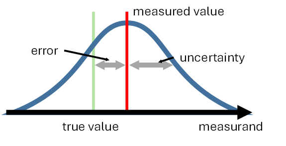

Navigating the world of uncertainties can be quite tricky, as oftentimes terms such as _errors_ and _uncertainties_ are used interchangeably, even though they do not describe the same thing.

In this brief introduction to uncertainties and their propagation, we will highlight the most important concepts and signpost you to useful resources. 

By providing learning materials covering relevant topics at varying levels of depth, we want to ensure that you can fully understand and therefore implement the capabilities of this toolkit. 

## ❔ Why do we care about uncertainties?

Uncertainties are a vital aspect of the measurement science, as they provide credibility and trust in measured data. 

To ensure that everyone is on the same page, a great place to start is this [Measurement Good Practice Guide](https://eprintspublications.npl.co.uk/1568/1/MGPG11.pdf#:~:text=Every%20measurement%20is%20subject%20to%20some%20uncertainty.%20A,environment%2C%20from%20the%20operator%2C%20and%20from%20other%20sources.) put together by the National Physical Labpratory (NPL).

It covers all the relevant terminology, best practises, and examples for understanding the uncertainty of measurements. 

As mentioned at the beginning of this article, we can confirm that _uncertainties_ and _errors_ are, in fact, not the same thing: 

  > **Uncertainty** is a quantification of the doubt about the measurement result. 

  > **Error** is the difference between the measured value and the "true value" of the thing being measured. 

## 📜 Metrology & the Guide to Uncertainties in Measurements

Metrology, the science of measurement, is the discipline that maintains the SI and the associated system of measurement, ensuring measurements are stable over time and measurement standards equivalent worldwide. These properties are supported by the principles of metrological traceability: uncertainty analysis and comparison.

The Guide to the expression of Uncertainty in Measurement or **GUM** for short, is the ultimate resource to refer to, when you are evaluating measurement uncertainties. 

All the official documentation of GUM as well as a guide to the **International Vocabulary of Metrology** (VIM) are available [here](https://www.bipm.org/en/committees/jc/jcgm/publications). 

## 🏆 Best practice framework for EO

To ensure credible and reliable interpretation of environmental observations from satellites and in-situ measurements, Committee on Earth Observation Satellites (**CEOS**) has established and endorced the Quality Assurance framework for Earth Observation [(**QA4EO**)](https://qa4eo.org/). 

This framework requires that associated uncertainty information is provided for all measurements. Additionally, it highlights the importance of understanding the **error-covariances** in the data is. 

Approaches defined within QA4EO enable the EO community to develop quantitative characterisation of uncertainty in EO data. 

QA4EO developed a 5-steps approach to do an uncertainty budget. These 5 steps are described in the   

However, practically implementing these methods is not trivial and can be time consuming. 

As a way to facilitate this, the CoMet Toolkit was developed as a means to store and propagate uncertainty and error-correlation information. 

## ✔️ Uncertainty in Earth Observations (EO)

Considering the origins of this toolkit, it makes sense to dive a bit deeper into the uncertainties in the context of **Earth Observations**.

A great resource that describes all the various aspects of uncertainty propapagtion for satellite EO data is [**FIDUCEO**](https://research.reading.ac.uk/fiduceo/). 

This project provides a comprehensive guide to understanding and implementing:

  - [Measurement functions](https://research.reading.ac.uk/fiduceo/fcdrs/theoretical-basis-2/1-determining-the-measurement-function/)
  - [Uncertainty effects](https://research.reading.ac.uk/fiduceo/fcdrs/theoretical-basis-2/2-defining-uncertainty-effects/)
  - [Uncertainty trees](https://research.reading.ac.uk/fiduceo/fcdrs/theoretical-basis-2/2-defining-uncertainty-effects/)
  - [Effects tables](https://research.reading.ac.uk/fiduceo/fcdrs/theoretical-basis-2/4-completing-the-effects-table/)
  - [Harmonisation](https://research.reading.ac.uk/fiduceo/fcdrs/harmonisation/)

